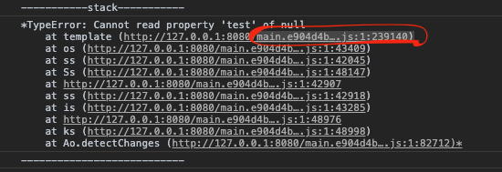
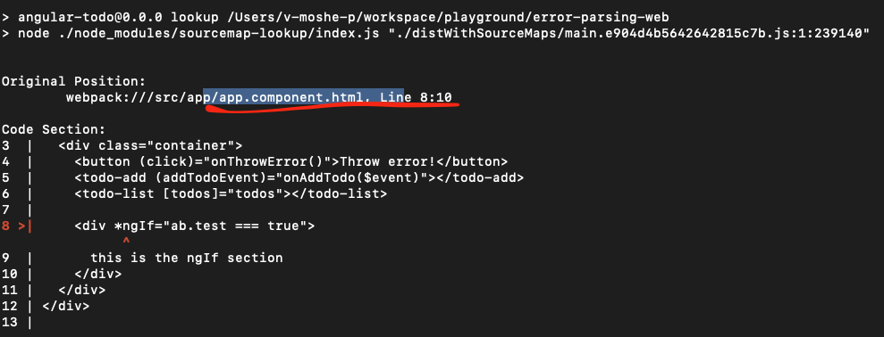

# AngularTodo
This project was generated with [Angular CLI](https://github.com/angular/angular-cli) version 11.2.0.

## Build
Run `npm run build` to build the project. The build artifacts will be stored in the `distWithSourceMaps` directory.
Note: you can run this app using `live-server`. you can readm more about this [here](https://www.npmjs.com/package/live-server)

## Lookup
Run `npm run lookup [filename]:[line]:[column]` to find the error in sourcemap

Example:\


```
> npm run lookup ./distWithSourceMaps/main.e904d4b5642642815c7b.js:1:239140 
```


## Development server
Run `ng serve` for a dev server. Navigate to `http://localhost:4200/`. The app will automatically reload if you change any of the source files.
